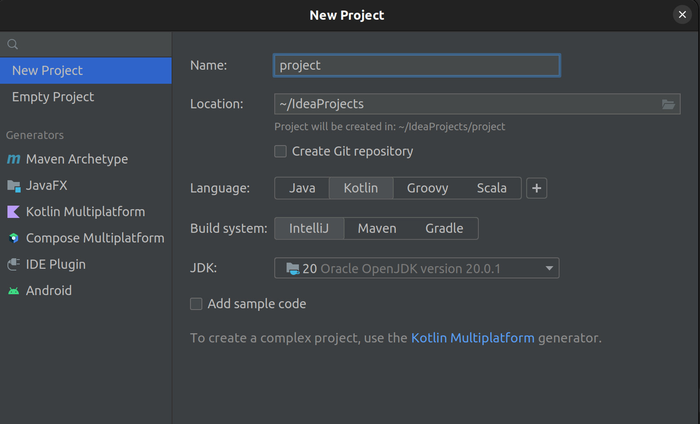

# 01 - Introduction en Kotlin

## Pourquoi Kotlin?
Kotlin est un langage moderne de programmation qui offre beaucoup de mécanismes pour assurer la sécurité du code, aussi qu’une syntaxe facile.

Kotlin offre la possibilité de développement sur plusieurs platformes, étant compatible avec le JVM. Au même temps, toute bibliothèque en Java peut être utilisée dans un programme écrit en Kotlin. L’inverse est aussi vrai. À cause de tout cela, on considère qu’apprendre ce langage peut vous aider aussi à l’avenir, pour vos projets futurs. 

## Syntaxe de base
Pour commencer à apprendre Kotlin, on vous prie de suivre toutes les chapitres du tutoriel suivant: [Tour de Kotlin](https://kotlinlang.org/docs/kotlin-tour-welcome.html).

## Développement
Pendant ce semestre, on va utiliser l’IDE IntelliJ. Pour installer Kotlin, vérifiez le lien dans la séction “Sources”.

 Pour créer un nouveau projet en Kotlin, choisissez le langage “Kotlin”:
Ensuite, vous pouvez commencer à écrire de code.

## Exercices
Parcourez les chapitres suivantes et résolvez les exercices: [Exercices](https://play.kotlinlang.org/koans/overview)

## Sources

### Liens nécessaires:
* [La page principale de Kotlin](https://kotlinlang.org/)
* [La bibliothèque standard de Kotlin](https://kotlinlang.org/api/latest/jvm/stdlib/)
* [Installation d'IntelliJ](https://www.jetbrains.com/help/idea/installation-guide.html)

### Liens supplémentaires
* [Kotlin Blog](https://blog.jetbrains.com/kotlin/)
* [Kotlin pour Android](https://kotlinlang.org/docs/android-overview.html)

