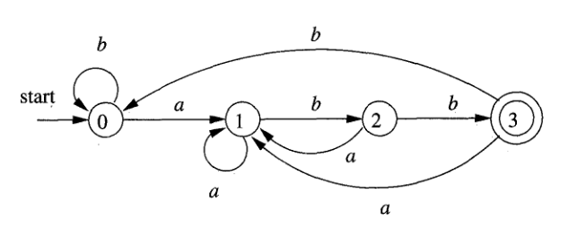
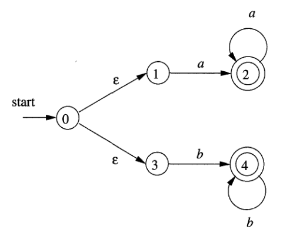
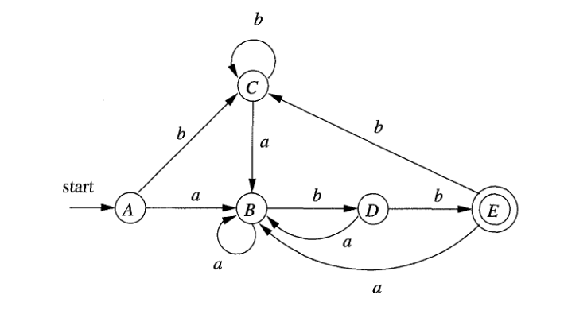

# 03 - Automates Finis

## Le problème posé
Pour un compilateur, au commencement du processus de compilation, tout fichier avec du code est vu comme un chaîne de caractères dans lequel il faut identifier les mots composantes et les partager dans des jetons (*tokens*). Pour faire cela, on a besoin d’une méthode de reconnaître certaines sous-chaînes dans le texte initial. Les automates finis offrent une bonne solution à ce problème.

## Définitions

Du point de vue mathématique, on definit les automates finis comme un tuple composé par:
- un ensemble fini des états $S$;
- un ensemble fini de symboles $\Sigma$, nommé **l’alphabet d’entrée** (le chaîne vide $\epsilon$ n’est jamais membre de $\Sigma$);
- une fonction de transition f qui donne, pour chaque combinaison d’état et symbole d’entrée, un ensemble d’états prochaines;
- un état $s_0$, nommé l’état initial;
- un ensemble d’états F, un sous-ensemble de $S$, nomé états finals.

On utilise les automates finis de la manière suivante: on commence dans l’état initial et on lit le premier caractère de notre chaîne. On applique la fonction de transition pour voir quel est le nouvel état. Ensuite, on prend le deuxième caractère du chaîne avec ce nouvel état et on applique encore une fois la fonction de transition. On continue jusqu’à la fin du chaîne.

On dit que l’automate **accepte le chaîne** si l’état final appartient à F. L’ensemble des chaînes acceptés par un automate s’appelle **le langage** de cet automate.

<br></br>

Il y a deux genres d’automates finis:
- **déterministe** (AFD): la fonction de transition n’accepte **jamais** $\epsilon$ comme entrée (on ne peut pas passer d’un état vers un autre sans recevoir un caractère) et la fonction de transition donne **un seul état** pour chaque combinaison d’état et symbole d’entrée (d’un état, par recevoir un symbole, on peut aller vers un seul autre état);

- **indéterministe** (AFI): la fonction de transition **accepte** $\epsilon$ comme entrée (on peut passer d’un état vers un autre sans recevoir un caractère) et la fonction de transition **peut donner plusieurs ou aucun état** comme résultat (d’un état, par recevoir un symbole, on peut aller dans plusieurs autres états ou on peut s’arrêter à cause du fait que la transition n’éxiste pas).

## Représentation graphique
On peut représenter les automates finis commes des graphes orientés dans lesquelles les noeuds sont les états de S et la fonction de transition est marquée par poser les symboles correspondants sur les arêtes (par exemple, la transition de $s_0$ à $s_1$ avec le symbole ’a’ est représentée comme une arête de $s_0$ à $s_1$ avec la valeur ’a’). Cela est parfois plus facile que la définition mathématique.

Exemple de AFD:



Exemple de AFI:



:::info
    L’état initial est indiqué avec une fléche et le mot “start”. Les états finals sont indiqués avec un cercle double.
:::

:::tip
    Observez, pour chaque automate fini, ses caractéristiques:
  - pour AFD, chaque état a seulement deux transitions possibles, correspondant aux symboles de l’alphabet $\Set{a, b}$
  - pour AFI, on a des transitions avec $\epsilon$ (de $s_0$ à $s_1$ et à $s_3$) et quelques transitions n’existent pas ($s_1$ ou $s_2$ avec ’b’ et $s_3$ et $s_4$ avec ’a’)
:::

## Implémentation
L’implémentation d’un automate fini avec l’état initial $s_0$, le seul état final $s_m$ et la fonction de transition f qui doit reconnaître un modèle $P$ de longueur $m$ dans un texte $T$ de longueur $n$:
````kotlin    
    fun automate_fini(
        T: String,                   //le texte
        f: (State, Char) -> State,   //la fonction de transition 
        m: Int                       //la longueur du modele 
    ){
        val n = T.length()
        var q: State = s_0           //l’état initial
        for(i in 0..n-1){            //parcourir le texte
            q = f(q, T[i])           //appliquer la fonction de transition pour obtenir l’état suivant
            if(q.equals(s_m)){       //l’état final - pour plusieurs états finals, on fait plusieurs comparaisons
                println("On a trouvé P dans T")
            }    
        }        
    }            
````
On peut voir que, sachant la fonction de transition, on a besoin seulement de parcourir le texte et verifier toujours l’état dans lequel on se trouve. Une autre question devient maintenant le problème: comment calculer cette fonction de transition? 

Pour un modèle $P$ et un alphabet $S'$, on obtient la fonction de transition f:

````kotlin
    fun calcule_fonction_de_transition(
        P: String, 
        S': List<Char>
    ): HashMap<(State, Char), State> 
    {
        val f = HashMap<(State, Char), State>()
        val m = P.length()
        for(q in s_0 to s_m):
            for(a: Char in S'):
                var k = Math.min(m+1, q.index()+2)
                do{
                    k = k-1
                }while()
                    
                until P[0..k] is a suffix for (P[0..q.index()+1] || a)
                f.put((q, a), s_k)      //l’état avec l’index k
        return f
    }    
````

Dans ce code, l’opérateur ```||``` signifie la concatenation et ```P[0..k]``` est le sous-chaîne de P à partir de la position 0 jusu’à la position k (exclusivement). L’index d’état $s_m$ est m.

# Exercices
1. Pour l’AFD et les mots donnés, écrivez les états et les transitions et dites si les mots sont acceptés: 
 - bbabaa
 - aaababb
 - abbbabab


2. Utilisez ce [site](https://madebyevan.com/fsm/) pour créer les automates finis suivantes:
- un AFI qui accepte les chaînes: 011001, 11110000 et 10010011
- un AFD qui accepte les chaînes: abbccc, cbaaab et acccbaab
- un AFD avec l'alphabet {'a', 'b'} le langage duquel est l'ensemble des chaînes avec le nombre de ’a’ multiple de 3
- un AFD avec l'alphabet {'a', 'b'} le langage duquel est l'ensemble des chaînes avec un nombre paire de 'a' et un nombre impaire de 'b'

3. Implementez en Kotlin un automate qui cherche le modèle "aabab". Affichez les positions des occurences du modèle dans le chaîne "aaababaabaababaab" 

4. Implementez en Kotlin le dernier automate de l'exercice no. 2.

5. (Bonus) Soit un automate $A_1$ avec l'alphabet {'a', 'b'} qui accepte les chaînes qui commencent avec ’a’ et contiennent que ’b’ au dehors et $A_2$ un automate avec le même alphabet, qui accepte seulement le chaîne “abbaa”. Représentez les deux automates et implementez un automate $A_3$ qui accepte $w_1 || w_2$, où $w_1$ est un mot appartenant au langage de $A_1$ et $w_2$ est un mot appartenant au langage de $w_2$.