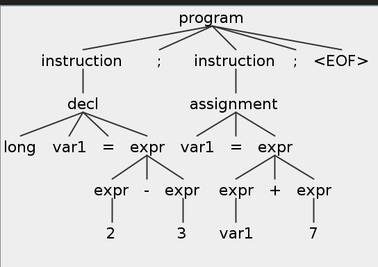

# 06 - Visitor et Framework

Le TP précédent, on a appris comment utiliser ANTLR pour écrire des grammaires et pour générer un Lexer et un Analyseur. Ensuite, on a réussi de créer et accéder à l’arbre d’analyse de notre code. On a vu qu’on pouvait voir les règles et leurs composantes (les enfants dans l’arbre d’analyse). Ce qui suit, c’est d’utiliser toutes cettes informations dans notre compilateur. 

Pour continuer avec notre traitement (par exemple, pour faire l’analyse du code du point de vue semantique), il faut parcourir l’arbre d’analyse. Parce qu’il s’agit d’un arbre, on peut le traverser en utilisant DFS (depth-first search/recherche en profondeur)



## Visitor

Au dehors du Lexer et Analyseur, ANTLR a aussi l’option de générer un Visiteur. Son but est de simplifier le processus de traitement de l’arbre d’analyse. Le Visiteur offre aux programmeurs un moyen de définir des fonctions qui s’exécutent au moment qu’on arrive à une certaine règle dans notre arbre d’analyse.

Prenons l’exemple suivant de grammaire:
```antlr4
grammar demoVisitor;


```

### Étiquettes pour les règles et les variables

## Compiler Framework

## Exercices

## Bibliographie