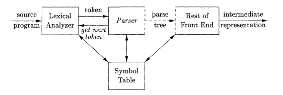
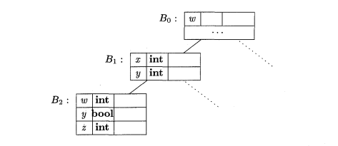

# 07 - Analyse sémantique

## AST
**L’arbre abstrait de syntaxe** (**abstract syntax tree** - AST en anglais) est une représentation hiérarchique du code source écrit dans un langage quelconque sous la forme d’un arbre. Du coup, ce qu’on a commencé le TP précédent (la traduction du code source dans notre collection de classes) est la création de l’AST. 

L’AST resemble l’arbre d’analyse (parse tree) dans la structure. La différence est au niveau du contenu: dans l’arbre d’analyse, les noeuds intérièures étaient les non-terminaux, mais dans l’AST, les noeuds sont des concepts de programmation (dans notre cas, les classes).

L'AST est ce qu'on appelle une **représentation intermédiaire** (**intermediate representation**). On utilise les représentations intermediaires dans notre compilateur pour avoir une transcription de ce que le code source fait sans les contraintes du langage source.

## Le tableau de symboles

Le **tableau de symboles** est une structure de données utilisée par les compilateurs pour sauvegarder de l’information sur le programme source. Les entrées du tableau de symboles contiennent l’information sur les identificateurs, leurs types, leurs positions dans la mémoire et tout autre choses nécéssaires. Le role d’un tel tableau est de passer l’information depuis les déclarations vers les utilisations. 



Le compilateur peut interagir avec le tableau de symboles dans plusieurs étapes de la compilation: dans l’analyse léxicale, l’analyse syntaxique ou celle sémantique. Pendants notre TPs, on va étudier seulement l’utilisation pendant l’analyse sémantique. C’est-à-dire, après avoir obtenu notre AST contenant une représentation du code source, on le parcourt pour remplir le tableau et pour faire l’analyser.

Les étapes sont les suivantes:
- on commence à traverser notre arbre d’analyse à partir de la racine
- chaque fois qu’on rencontre une définition d’une variable, fonction ou type, on ajoute les nouvelles informations dans notre tableau de symboles
- chaque fois qu’on rencontre l’utilisation d’une variable, type ou fonction, on vérifie le tableau de symboles. Si on trouve une entrée qui corréspond, on peut continuer avec l’analyze sémantique en utilisant l’information sauvegardée dans le tableau. Autrement, en fonction des règles de notre langage de programmation,soit on renvoie une erreur, à cause de l’utilisation d’un symbole pas défini, soit on ajoute une nouvelle entrée dans le tableau.

### Portée (Scope)

On appelle **portée** (ou **scope** en anglais) une partie du programme où il y a une collection d’identificateurs. La portée d’un identificateur quelconque représente la partie du programme où cet identificateur est défini.

Les portées sont importantes dans un langage de programmation, car le même identificateur peut être utilisé plusieurs fois dans le même programme avec des significations différentes. Par exemple, les noms des variables i et x sont assez communs.

Chaque langage de programmation a sa propre manière d’identifier ses portées. Dans des langages comme `C`, `Java` ou `Kotlin`, on utilise les `{` `}`. `Python`, au contraire, emploie l’identation des lignes pour établir ses portées. 

### Implantation dans la bibliothèque

Ouvrez la documentation et cherchez la classe `domain.SymbolTable`. Observez qu’on gardera trois choses dans nos tableaux de symboles: les variables, les fonctions et les types. Pour le types, on gardera des instances pour les primitives du langage (donc pour des types comme `Boolean` ou `String`), mais aussi pour les types définis par l’utilisateur. 

Dans notre bibliothèque, l’intégration du tableau de symboles se passe au niveau du chaque portée. C’est-à-dire, chaque fois qu’une nouvelle portée commence, on crée une nouvelle instance de la classe SymbolTable, qui gardera les informations "locales", donc les définitions qui existent seulement dedans. Généralement, une nouvelle portée est crée au moment qu’on rencontre une nouvelle instance de la classe `Block`. Du point de vue logice, cette instance corréspond exactement à une portée. Le tableau de symboles associé à une instance se trouve dans le champs `scope`.

Avec notre approche, quand on vérifie l’existence d’un identificateur dans le code source, chercher dans la portée courante ne suffit pas. On peut avoir des situations ou une variable a été déclarée dans une portée supérieure et on veut l’utiliser dans une portée intérieure. Par exemple, si on déclare une variable avant une instruction if et on veut l’utiliser dans l’une de ses branches, il faut pouvoir l’accéder à l’interieur de la portée corréspondante.
 
Ce qu’on doit faire, c’est aller plus haut dans l’hiérarchie et chercher l’identificateur dans les tableaux de symboles supérieures. Pour cela, on utilise le champ `owner` de la classe `SymbolTable`, qui renvoie le parent .

```kotlin
var scope = node.scope
while(scope!=null){
    
    //recherche de l’information dont on a besoin

    scope = scope.owner.parent?.scope
}
```

Une visualisation graphique de ce processus: 



## Exercices
Ouvrez le fichier `TP7/app/src/main/kotlin/Analyzer.kt`. Suivez les taches suivantes:

1. Suivez les `TODO-1` pour ajouter une variable et son type dans le tableau de symboles au moment de son déclaration. 

    Pour les variables, vérifiez qu’elles ne soient pas déclarées déjà. 

    Pour les types, soit on a des primitives, le cas où vous pouvez ajouter une instance du type corréspondant dans le tableau de symboles, soit on a des types définis par l’utilisateur. Dans cette situation, il faut vérifier si le type existe ou non.  Vérifiez les types possibles dans la grammaire du fichier `TP7/app/src/main/antlr/tp7.g4`.

2. Suivez les `TODO-2` pour vérifier dans une expréssion mathématique le type résultant. Pour faire cela, il faut vérifier les types des composantes de l’expréssion. Faites attention au fait qu’une expression peut aussi être une valeur ou un identificateur.
   
3. Suivez les `TODO-3` pour vérifier, dans une affectation, que les types de données corréspondent. Cherchez dans les tableaux de symboles le type de la partie gauche et celui de la partie droite et ensuite comparez-les. Vous pouvez considerer les types float et int compatibles.

## Bibliographie